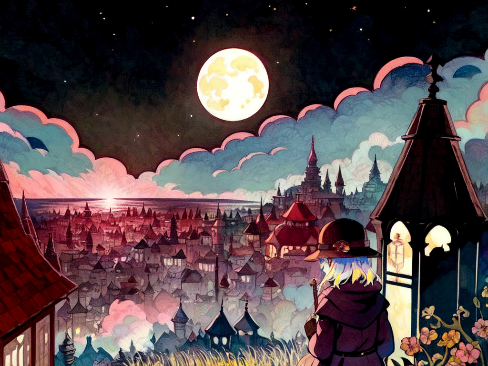
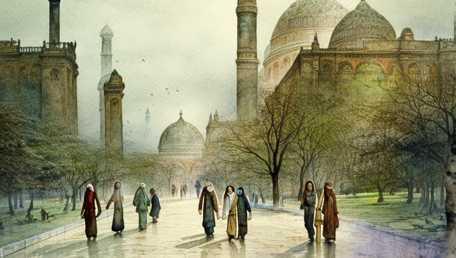
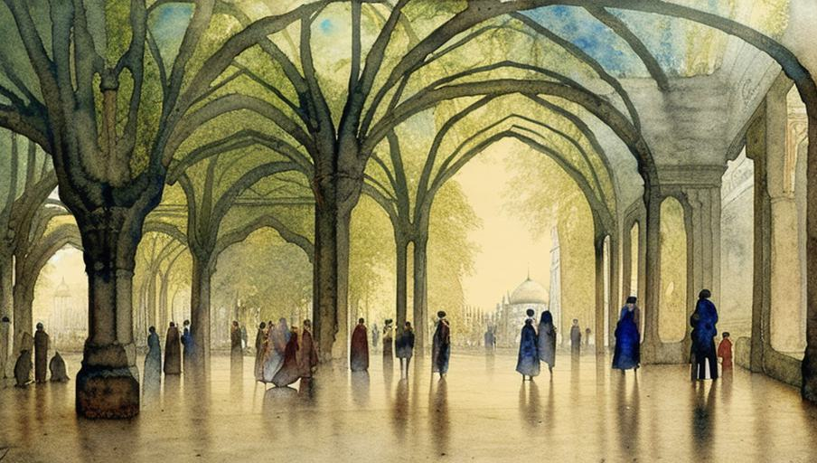

# That Which Echoes Across Our Home
A game to guide you in the creation of a city by mapping its districts, landmarks, and history.  Along the way you'll create generations of residents, their communities and factions, the territory they claim, their disputes and unions, and the heritage they leave to the city in their wake.

version: 6/16/2023

&nbsp;

&nbsp;

## Preparation
To play this game you'll need a couple players (probably 3-5, though less or more is also fine) and some dice for rolling on tables (one of each: d6, d8, d10, d12). If you're playing in person, you'll need some blank sheets of paper, pencils, and probably scissors.  If you're online, you'll need a shared drawing or whiteboard program.  Additional material for note keeping such as index cards or a notebook or google doc is recommended, but not necessary.

If many players are playing the game for the first time, read the rules aloud as you go.

&nbsp;
## The Starting Player
Whoever played most recently (or, if no one has played, whoever feels they know the rules the best) is the Starting Player.  The starting player has two roles: first they'll guide everyone through the rules of the game, reading or assigning readers for each section.  Second, whenever the rules say "one at a time" or "taking turns", you begin with the starting player and go around the table from there.

Most people playing will get to be the starting player at least once.  At the end of each phase (once after Mapping, and then at the end of each Generation of residents), the Starting Player hands the role to the next person at the table.

&nbsp;
## Conversation & Authorship
"It's only in mediocre books that people are divided into two camps and have nothing to do with each other. In real life everything gets mixed up! Don't you think you'd have to be a hopeless nonentity to play only one role all your life, to have only one place in society, always to stand for the same thing?" - Boris Pasternak, Doctor Zhivago

This game is a conversation.  There are dice and tables to roll against- true- and a board of sorts, and a sequence of rules that tell you what to do next.  But those aren't the game any more than a city is the sum of its blueprints.  Treat the rules like building materials.  They're your dirt, wood, cement, steel, and glass.  The conversation is the machinery and people that set the materials in place.

This game is also a production.  You're going to map and build a city, a thing that exists beyond the liminal space of the game and its conversations.  During the process you'll each take turns acting as its supervisors, leaders, archivists, and insurgents: that is, you are all, equally, authors here, sharing ownership of the production.  The thing about shared ownership is that it leads to contention.  That's good.  Sharing doesn't require consensus.  You don't all need to agree to move the game forward (and how often do all the residents of a city agree with each other?).  Each spark of disagreement, surprise, and ingenuity is what will give the place its living breath.  Lean into that.

&nbsp;
## Safety & Tone
“With cities, it is as with dreams: everything imaginable can be dreamed, but even the most unexpected dream is a rebus that conceals a desire or, its reverse, a fear. Cities, like dreams, are made of desires and fears, even if the thread of their discourse is secret, their rules are absurd, their perspectives deceitful, and everything conceals something else.” - Italo Calvino, Invisible Cities

If you haven't explored safety tools before, take a moment to do that now.  Others have written well on the subject already and a quick search will bring up plenty of options.  At minimum, I'd recommend you set up _Lines and Veils_ and an _X Card_.  See [Anne LoVerso's blog](https://www.anneloverso.com/rpg-safety-tools) for details on both.  And, of course, take a break during play now and then.

After your safety tools are established, start a conversation at the table and answer each of the following questions.  Take as much time as you need to ensure everyone at the table has had an opportunity to give input.

* What is the overall tone we want to explore?  Light-hearted idealism, harsh reality, epic grandeur, or something else?
* Which themes or topics do you want to avoid?
* Which themes or topics are you eager to include?

Opinions and comfort will change throughout the game; a topic someone initially found approachable may turn unpalatable.  Or the opposite!  What was off-limits might, within context, begin to intrigue the person who banned it.  Update the boundaries of tone and safety as often as you need.  And, please, check in with the other people at the table to see if they're still good, especially if the story veers towards the edge of safe spaces.

&nbsp;
## Era, Genre, & Focus
“If Music is a Place -- then Jazz is the City, Folk is the Wilderness, Rock is the Road, Classical is a Temple.” - Vera Nazarian

The groundwork of your city is its era: the span of time it lives, the place it inhabits, and the genre trappings easily seen in its hustle and bustle.  Start a conversation at the table and answer all of the following questions.  Don't take too long here, you have lots left to do.  You don't need to justify or backstory your decisions.  Simple answers are enough, so two or three minutes on each question should be plenty.

* Are you playing this game to kick-start a different campaign, such as another rpg?  If so, does everyone clearly understand the setting and genre of that next game?
* What time period or setting is your city located within?
* Is there a specific genre or lens you want to explore?
* What technology, magic, or weirdness is present?

For the rest of the game these answers will act as your compass and form your cardinal directions.  Use them like a list of goals, a plan for what the city could become.  Whenever a player or a conversation stalls, come back here and look at the era for new ideas.  Ask: how can we bring these details to life?  How can we evoke the purpose of this city?

&nbsp;

---

&nbsp;
# Mapping The City
The first step in creating your city is to draw its map. In this phase you'll design from a birds-eye view: outlining districts, placing landmarks, marking the primary roads and other means of transport, and gesturing towards the lands that surround the city.  Everything you add in this phase is permanent, unless intentionally changed, and lasts throughout the rest of the game.

&nbsp;
## The Walls
With a blank sheet of paper (or blank layer in your drawing program) the starting player begins by sketching a simple outline to mark the outer walls.  These don't need to be literal walls, but they do mark the boundary of the city.  A distinct line which, once crossed, means you've gotten _inside_ the city.  All players should contribute ideas for this part, but only the starting player gets to draw.

Once complete, the walls of your city should take up most (but not all) of the space on the sheet.  The majority of the game involves filling out what inside these walls, so you'll want lots of room to play around.  Leave just a little space around the edge to discover what lies outside.

&nbsp;
## Districts
Taking turns, each player creates a district by sectioning off some space within the walls of the city.  Each player must add at least one district (only one per turn), and at most three, until the city has been completely partitioned.  No two districts can overlap on the same spot, and every part of the city needs to be part of a district.  Beyond those rules, anything goes: districts can be large or small and should vary in size.  Their shape and positioning should be as irregular as the player wishes.

When the residents first put a shovel to this dirt they had a plan in mind, an overarching theme: that the area would be made for working, or for living; to show off for guests, or to hide from residents.  But time changes opinions, people migrate, and districts grow beyond their purpose.  No matter which design you choose below, you can assume every district will have residences and stores, public and private space, places both aligned and apart from the plan.

When you place a district, give it a name and a Design.  Roll on the table below, or just pick the one that interests you.  If you want to get more detailed, there are additional tables at the bottom of the rules that expand on the designs.  Finally, answer a few of the questions below and tell your answers to the other players.

|d10|Designs|||
|---:|---|---:|---|
|1|industrial|6|repurposed|
|2|entertainment|7|farms and gardens|
|3|residential|8|slums or ghettos|
|4|institutional|9|natural preserve|
|5|affluent|10|ruined or uninhabitable|

* What does daily life look like?
* What sorts of people do you expect to see?
* What common events take place there?
* What is the larger community vibe?

&nbsp;
## Landmarks
Taking turns, each player adds a landmark to the map.  A landmark is anything that every person in the city will recognize.  Prominent buildings, grand statues, a canyon interrupting the suburban sprawl, that sort of thing.  Landmarks can be modern or ancient, created by previous or current residents of the city, or they could predate the city itself.

Roll on the table below, or just pick the one that interests you.  If you want to get more detailed, there are additional tables at the bottom of the rules that expand on the designs.

|d10|Landmarks|||
|---:|---|---:|---|
|1|statue or fountain|6|marvel, wonder, or artwork|
|2|school, university, or building|7|park or cemetery|
|3|place of worship|8|location of a historical event|
|4|natural feature|9|marketplace|
|5|significant architecture|10|bar or theater|

**TODO:** ask and answer questions about the landmark?

&nbsp;
## Entrances and Exits
Taking turns, each player creates one way to get in and out of the city.  This can be as simple as a gate along the walls where a major road might be later placed, a giant mechanical lift, a port of entry or train station, or some manner of portal or apparative transport.  Entrances and exits can be kept secret from the community, too.  So long as it can get people in and out of the city, it counts.

&nbsp;
## Roads and Transport
One at a time, each player draws either two major roads or one common method of transport that gets people around the city.  A method of transport should be institutional: something reliable, something people will congregate around.  Think: trains, trolleys, gondolas, aviator roosts, pneumatic tube stations, etc.  Less structured transport- taxis, electric scooters, horse and carriage, rickshaws- on a large enough scale those services count, too.

&nbsp;
## The Lands Beyond
Taking turns, each player names, sections off, and describes part of the land outside the city.  This step is primarily for you to paint the scenery.  No other parts of the game depend upon the lands outside.

_! Reminder: pass the Starting Player role to the next player._

&nbsp;

---

&nbsp;
# The Residents
The second phase of play tracks the generations of communities that inhabit the city.  In this phase you'll describe a community of people: the places they claim as their own, the figures that stand out from the crowd, the ways they meet and clash, and the notable things they add to the city (or remove from it).

The residents phase will repeat three times, with each iteration building on the last one.  We call each loop a Generation. The actual timespan of a Generation can be as long or as short as wanted, and can change with each loop.  It doesn't need to line up with a single generation of people, in the genealogical sense.

&nbsp;
## Community
To start the phase, all players take a few minutes on their own to create a new community.  For the rest of the generation, you, the player, will act as the sole author of your community.  Anyone at the table may ask questions about your community, but only you have the final say on how your community acts, what it believes, and what it has endured.

A community is defined by three aspects: the ties that bind them, the characteristic that they live by, and the strength which makes them notable.  You can decide those for yourself if you want.  But if you need some inspiration, pick or roll from the table.

|d10|Ties||Character||Strength|
|---:|---|---:|---|---:|---|
|1|political|1|secretive|1|funding|
|2|subculture|2|clever|2|equipment|
|3|corporation or ruling elite|3|destructive|3|entrenched|
|4|gang or crime|4|imposing|4|mobilized|
|5|outsiders|5|honorable|5|championed|
|6|religion|6|practical|6|exclusivity|
|7|minority|7|beautiful|7|well-liked|
|8|youth|8|competitive|8|art or philosophy|
|9|refugees|9|disciplined|9|hidden|
|10|rebellion|10|chaotic|10|trained|

After you've picked your community's ties, character, and strength, you have three more things to figure out.  First give the group a name.  Something the other people in the city would know them by.  Second, give them a belief.  This belief is their guiding compass.  It defines their center, their principles, and sets them apart from all other residents in the city.

Finally, determine their relationship with the city.  What does their interaction with other residents look like? Again, you can decide these for yourself, if you want; or for inspiration, pick or roll from the table below.

|d10|Relationship with the City|
|---:|---|
|1|Other people fear us.  Why?  How do they put their fears on display, to show us we're not wanted?|
|2|We are recognized by the few on our fringes while our silent center toils, failing, at what?|
|3|Our ideas fluoresce; bloom in the streets with zealotry.  Which do our believers take too far?|
|4|We give and give to this city.  Who benefits?  Who doesn't?|
|5|Present but unseen, noticed but unheard.  We are invisible, unacknowledged.  Why?|
|6|Our presence extends will impact many residents, but not all.  Who do we disregard or ignore?|
|7|We lead.  Who follows?  How do we ensure no one disrupts our advantage?|
|8|Reputation always precedes us, even while we outgrow the story.  Which old stereotypes shadow us?|
|9|Find us secreted within ourselves.  Living only through little, cautious escapes.  How do we find each other?|
|10|The city fails to grasp our shape.  Are we a new idea or a misunderstood norm?|

Don't introduce your community yet.  Once everyone is done with this step, move on to the next.

&nbsp;
## Territory
Taking turns, each player marks a section of the city (no larger than half of the total space) as territory claimed by their community.  Territory, most simply, marks where the people in your community are usually found.  What space they consider "theirs".  People utilize their space in different ways: they can be hospitable or protective, enforcers or recluses; they may grind that part of the city under their heel, or support and build up the people and space around them; they might simply reside, hoping to live a simple and quiet life.

After a player has claimed a territory, they introduce their community to everyone at the table.  Take a moment to let everyone ask questions about the community and their history.

Territories may overlap with each other.  If they do, all players who have marked territory there should decide whether the space is in conflict (ie: the communities fight each other for control), cooperatively held (the communities work together towards common goals), or neutral (neither one cares that the other is there).

Throughout play, territorial markings can build up and get pretty messy.  If you're playing online hopefully your whiteboard or drawing app has a system of layers which let you render each territory separately from other parts.  When in person these layers can be a lot harder to keep separated.  One trick you can try is to have some extra paper or 3x5 cards on hand.  Instead of drawing on top of the map, cut out the outline of your territory with a pair of scissors and place these separate slips on top of your drawn map.

&nbsp;
## Notable Persons
One at a time, each player introduces a notable person or group within the community.  Name them, and say why the city recognizes their importance.  This character is an instigator of change.  Through their life, work, or possibly even death, they will change the community forever.  They might be the seed from which the community began, or the height of its vitality, or someone that changed what the community believed and practiced.

Once a notable person or group is introduced, each other player takes a turn asking one of the following questions.  Take a moment to discuss the answers, and their implications on the city, as a table.

* What goal were they never able to achieve?
* Who in the city was their biggest antagonist?
* What details of their life are often left out of the telling?
* Which group still reveres or resents them?
* Did they affect change outside their community?

&nbsp;
## Events
The starting player chooses another player and suggests an event that happened between their two communities.  An event is any moment that is historically significant to both players' communities, and to others in the city.  These moments can be sudden and short-lived (a meeting, a clash, a fete) or prolonged movements (a project, a grudge, a holiday).

After the event is described, the table starts a conversation to discuss how the event ripples out through the city.  Take time to dig in and explore the results, asking each other questions along the way.  Do things change for people afterward?  Does the city treat these communities differently?

Once everyone is done resolving the current event, start over again with two different players. The player who was picked last now does the picking, and they must choose someone who hasn't started an event yet.  Keep doing this until every player has described a new event.  The very last player to create an event must pick the starting player.

&nbsp;
## Heritage
Each community puts their mark on the city, leaving something behind that the other residents for generations to come.  Name a significant place, thing, idea, or tradition that this community brings to the city.  If possible, record it on the map.

|d12|Heritage|||
|---:|---|---:|---|
|1|holiday or festival|7|statue, architecture, or artwork|
|2|fashion or identity|8|place of worship or entertainment|
|3|new plants, animals, or disease|9|museum or memorial|
|4|food, drink, or dance|10|trade, magic, or engineering|
|5|philosophy or ethos|11|drugs, weapons, or contraband|
|6|sport or hobby|12|tear down something present|

&nbsp;
## Transitioning Generations
At the end of a generation, the city undergoes a period of transition.

### First: the people
All players give up authorship of their community.  These people now belong to the city, to the table as a whole.  What happens to the community- whether it continues its path or changes course, fractures or merges, thrives or disappears- is now a question for anyone and everyone to answer.  Unless otherwise stated, assume that the community remains present within the city, and within the same territory.

### Second: the echo
A great event occurs, and it echoes across the city and all its residents.  The starting player decides what it is.  You can roll on the table below, pick the most interesting option directly, or skip the table and describe something else that piques your interest.

|d12|That Which Echoes|||
|---:|---|---:|---|
|1|disease or famine|7|something abnormal arrives|
|2|wonderous invention or discovery|8|war or conquest|
|3|civil disorder|9|incredible trade or surplus|
|4||10|institutional failure or breakdown|
|5|climate or natural disaster|11|civil progress|
|6|something essential is lost|12|person-made disaster|

This upheaval may occur briefly, it may suddenly boom and then linger, or it may drag on for years, even generations, to come. Residents in the tumult will join together and turn apart.  They will form and break bond, find new family, swear grudges, draw and redraw the boundaries between each other.  Eventually the city stabilizes, settling into a new normal, and play begins again.

One at a time, each player asks the table one question from the following list (or a different question, if you have one in mind).  Everyone may contribute to the answer.  Use these questions to explore the ramifications of the event and to paint images of the city through this time.

* Could this have been predicted, and if it was, were preparations made in advance?
* Who interprets this as an act of some greater will, divine authority, or just retribution?  What salvation- or doom-saying did they preach beforehand?
* Did people do this intentionally?  Was it accidental?  What was their goal?
* What communities (you may include those that were not authored this generation) were hit the hardest?
* Which community (you may include those that were not authored this generation) gained the most?  Which community gained the least?
* Did any person or group leverage this situation for profit or other personal gain?
* Did this require an act of self-sacrifice?

While you answer these questions, you may find an urge to describe your community directly; the ways they respond and change to the context.  But remember, you've given up authorship.  Drop hints, make suggestions, but don't tell others what happens with certainty.  We'll find out what happens to your community in the next phase.

### Third: the result
If this is the end of the first or second generation, everyone goes back to the start of the community phase to investigate a new generation of residents.  (Reminder: pass the Starting Player role to the next player).

When making your next community, think about how they could have been shaped by those that lived before them.  How does prior territory influence the next claim?  Are the old beliefs rejected, accommodated, or exalted?  Especially important, remember that communities are organic; alive and changing.  People don't freeze in time just because the game carried on to a new generation.  Respect the source material (who the community is, what they believed in, how they acted), but also be bold and write history that leverages their growth or change, their successes and failures, and the ways they have shaped the current residents of the city.

If this is the third generation, the game is done.  Whatever state you've left the city in is now the current day, and all that might happen from here is an unexplored future with, I hope, thriving potential.

&nbsp;

---

---

---
# TODOs
* An "Events" phase driven by queues.