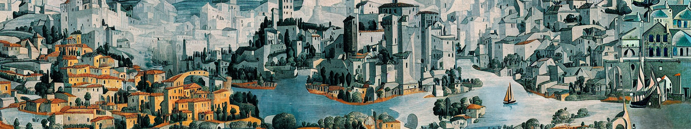

# Condensed Play Guide

## Preparation
Dice (d6, d8, d10, d12) and paper/pencils or a drawing program.

### Starting Player
Whomever played most recently, or whomever is most comfortable with the rules.

### Era, Genre, & Intent
Spend 2-3 minutes answering each:
* Are you playing this game to kickstart a different campaign, such as another pnp rpg?  If so, does everyone clearly understand the setting and genre of that next game?
* What time period or setting is your city located within?
* Is there a specific genre you want to explore?
* What technology, magic, or weirdness is present?

### Safety & Tone
Spend time answering each:
* What is the tone of the session?  Light hearted idealism, harsh reality, epic grandure, or something else?
* Which themes or topics do you want to avoid?
* Which themes or topics are you eager to include?
* What safety tools are in place?

### Authorship
You all share authorship over the city.  If you think there's an issue, consider:
1. Are we breaking our contracts with era, genre, tone, or safety?
2. Is there a misunderstanding about established truths?
3. Is this something difficult that I can let live and bloom?

---
## Mapping Phase

### Walls
Draw the outline of the city on your map.

### Districts
Each player outlines a section the city to become a district.  Name the district and specify its Design.  Then answer some or all of the following questions to describe it.

|d10|Designs|||
|---|---|---|---|
|1|industrial|6|repurposed|
|2|entertainment|7|farms and gardens|
|3|residential|8|slums or ghettos|
|4|institutional|9|natural preserve|
|5|affluent|10|ruined or uninhabitable|

* What does daily life look like in that space?
* What sorts of people do you expect to see?
* What common events take place there?
* What is the larger community vibe?

### Landmarks
Each player adds one landmark to the map.

|d10|Landmarks|||
|---|---|---|---|
|1|statue or fountain|6|marvel, wonder, or artwork|
|2|school, university, or building|7|park or cemetary|
|3|place of worship|8|location of a historical event|
|4|natural feature|9|marketplace|
|5|significant architecture|10|bar or theater|

### Entrances and Exits
Each player adds one route in and out of the city.

### Roads and Transports
Each player adds either two major roads, or one common method of transport.

### The Lands Beyond
Each player describes a section of the land surrounding the city.

_! Pass the Starting Player role to the next player._

---
## Residents Phase

### Community
All players take a few minutes on their own to create a new community.  They are the Author of this community for the rest of the generation.

Give them a name, something the other people in the city would know them by.

Give them a belief to act as their guiding pillar.

|d10|ties||character||strength|
|---|---|---|---|---|---|
|1|political|1|secretive|1|funding|
|2|subculture|2|clever|2|equipment|
|3|corporation or ruling elite|3|destructive|3|entrenched|
|4|gang or crime|4|imposing|4|numbers|
|5|outsiders|5|honorable|5|champions|
|6|religion|6|practical|6|exclusivity|
|7|minority|7|beautiful|7|well-liked|
|8|youth|8|competitive|8|ideas or art|
|9|refugees|9|disciplined|9|hidden|
|10|rebellion|10|chaotic|10|trained|

Do not reveal your community until the next step.

### Territory
Each player marks a section of the city (no larger than half of the total space) as territory claimed by their community, and then introduce their community to everyone at the table.

If territories overlap, the authors of those communities should decide if the shared space is:
* in conflict (both communities are fighting over the space)
* cooperative (both communities work towards common goals)
* neutral (neither in conflict nor cooperative)

### Events
The starting player picks another player and proposes a significant event that has occurred involving the two communities.  Once established, the selected player picks someone else (who hasn't been picked) and does the same.  Continue until everyone creates an event.

Discuss some of the following:
* How does this event ripple out through the city?
* Does life change for people afterward?
* Does the city treat these communities differently, or vice versa?

### Notable Persons
Each player introduces a notable person or group.  Once introduced, each other player asks them one of the following questions:

* What goal were they never able to achieve?
* Who in the city was their biggest antagonist?
* What details of their life are often left out of the telling?
* Which group still reveres or resents them?
* Did their effort or situation affect change in the city beyond their community?

### Heritage
Each player names a significant place, thing, idea, or tradition that the community brings to the city.  If possible, record it on the map

|d12|Heritage|||
|---|---|---|---|
|1|holiday or festival|7|statue, architecture, or artwork|
|2|fashion or identity|8|place of worship or entertainment|
|3|new plants, animals, or disease|9|museum or memorial|
|4|food, drink, or dance|10|trade, magic, or engineering|
|5|philosophy or ethos|11|drugs, weapons, or contraband|
|6|sport or hobby|12|tear down something present|

### Transition
The starting player leads the transition.

1. Give up authorship of your community.  They belong to the city.
2. Describe a terrible event.

|d6|Terrible Events|
|---|---|
|1|disease or famine|
|2|war or conquest|
|3|civil disorder|
|4|institutional failure or breakdown|
|5|climate or natural disaster|
|6|person-made disaster|

Each player asks one question from the following list.

* Could this have been predicted, and if it was, were prepartions made in advance?
* Who interprets this as an act of some greater will, divine authority, or just retribution?  What doomsaying did they preach beforehand?
* Did people do this intentionally?  Was it accidental?  What was their goal?
* What communities (you may include those that were not authored this generation) were hit the hardest?
* Which community (you may include those that were not authored this generation) responded most effectively?  Which community was least effective?
* Did any person or group leverage this situation for profit or other personal gain?
* Did anyone find a way for this event to eventually improve life in the city?  Did it require an act of self-sacrifice?

3. On the first and second generation, _pass the starting player role_ and run the Residents phase again.  On the third generation, the game ends.
